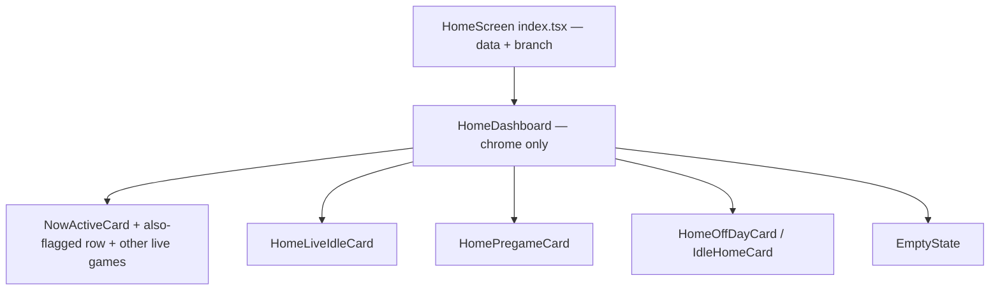
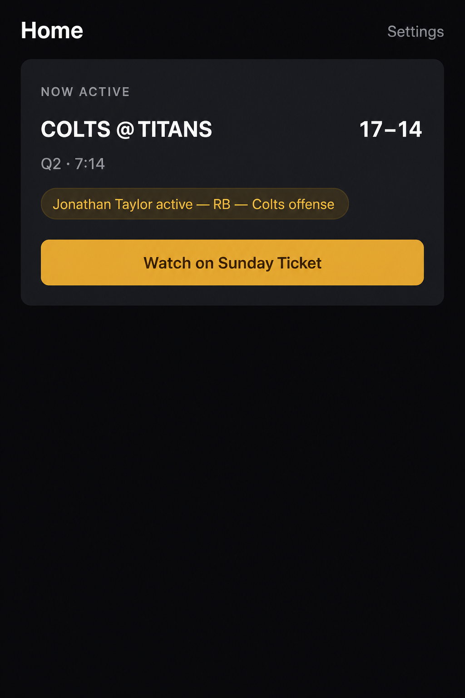
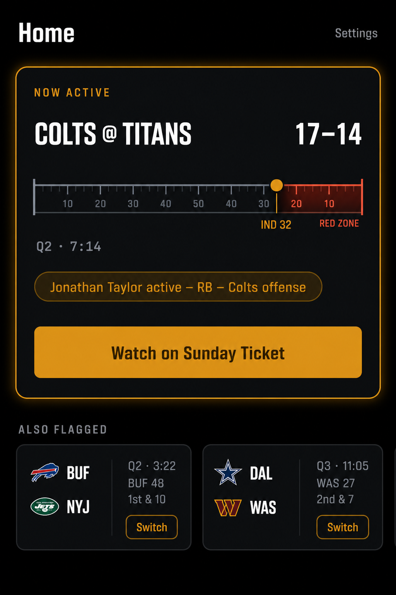

# UI Visual Spec — "Sportsbook Lounge" pass (sidecar, not source of truth)

Read-only, no-op pass: no `PLAN.md` or `app/` edits happened alongside this file. This is the incoming design brief translated into this repo's actual stack, tokens, and shipped screens, plus two rendered mockups so the look can be judged before anything is built. Treat it the same way as `[AUDIT-UI-POLISH.md](AUDIT-UI-POLISH.md)` — an inventory/intent document that a future sprint can turn into real diffs against `[app/lib/theme.ts](app/lib/theme.ts)` and the screens under `app/app/(app)/`. If a later pass implements any of this, fold the relevant parts into `PLAN.md` Section 10 and delete this file rather than letting two UX specs drift.

## 0. Stack correction

The source brief was written against Tailwind CSS, `backdrop-filter`, `box-shadow`, and three CSS breakpoints. This is an Expo / React Native client with dark-only design tokens in `app/lib/theme.ts`, styled via `StyleSheet.create`, no CSS engine, and (`PLAN.md` §4) **no web or TV app in v1**. Every recipe below is restated in that vocabulary. Where the brief assumes a capability this repo doesn't have (blur, motion, a settings field, live yardage data), that's called out as a gap rather than quietly implemented as if it already existed.


| Brief concept                               | This repo's equivalent                                                                                                                                                                      |
| ------------------------------------------- | ------------------------------------------------------------------------------------------------------------------------------------------------------------------------------------------- |
| Tailwind utility classes                    | `theme.colors` / `theme.spacing` / `theme.radii` / `theme.type` tokens, consumed via `StyleSheet.create` and the shared recipes in `[app/lib/controlRecipes.ts](app/lib/controlRecipes.ts)` |
| `backdrop-filter: blur(20px)` glassmorphism | Not free on RN. Deferred — see §2                                                                                                                                                           |
| `box-shadow` amber glow                     | iOS `shadow*` props / Android `elevation` on `View`, both platforms via `StyleSheet`                                                                                                        |
| Geometric sans / monospace ticker           | System UI font today (no font files in the repo); a reserved `theme.type.ticker` slot for later `fontFamily`, not a font asset added in this pass                                           |
| React/TypeScript components                 | Same — this app already is React Native + TypeScript strict, see `[app/components/](app/components)`                                                                                        |
| `lg:` breakpoint / 3-column web             | Out of v1 per `PLAN.md` §4 ("Android, web, TV apps"). Documented as future-web notes only, §4 below                                                                                         |
| TV / AirPlay billboard mode                 | Maps to `PLAN.md` §14's unbuilt Screen Mirroring reframe, not a v1 presentation flag. See §4                                                                                                |


## 1. Palette: what already matches, what's new

The amber/dark palette in the brief is already this app's palette. `PLAN.md`'s Known Issues (the "competing accent colors" entry, resolved pre-Sprint-10) records `#FFB020` as the chosen accent specifically because no NFL team owns it as a primary — this pass doesn't change that decision, it proposes a harder-contrast variant of the same system.

**Already in** `app/lib/theme.ts`**, unchanged:**


| Token                  | Value     |
| ---------------------- | --------- |
| `colors.accent`        | `#FFB020` |
| `colors.accentPressed` | `#E09A10` |
| `colors.onAccent`      | `#412402` |
| `colors.textPrimary`   | `#FFFFFF` |


**Proposed additions** (sketched in §5; not applied to `theme.ts` in this pass — `app/lib/theme.test.ts` pins the current hexes, so any of these would be a deliberate follow-up edit with test changes, not a silent swap):


| New token                        | Value                      | Replaces / sits alongside                                                                  |
| -------------------------------- | -------------------------- | ------------------------------------------------------------------------------------------ |
| `colors.canvas`                  | `#000000`                  | Optional harder-black screen background vs. today's `colors.background` (`#0B0B0F`)        |
| `colors.surface` (revised)       | `#121417`                  | Today `#1A1A20`                                                                            |
| `colors.surfaceRaised` (revised) | `#1A1C20`                  | Today `#22222A`                                                                            |
| `colors.textSecondary` (revised) | `#94A3B8`                  | Today `#9A9AA3` — close enough that this is a nice-to-have, not a fix                      |
| `colors.accentBorder`            | `rgba(255, 176, 32, 0.25)` | New — glass-panel stroke                                                                   |
| `colors.accentGlow`              | `rgba(255, 176, 32, 0.15)` | New — shadow color for the "active" glow in §2.3                                           |
| `colors.dangerMuted`             | `rgba(255, 90, 90, 0.14)`  | Already hand-rolled inline at `app/app/(app)/settings.tsx:816` — this just gives it a name |


No new hue is introduced. `danger` (`#FF5A5A`) and `success` (`#3ECf8E`) are untouched.

## 2. Material traits, translated


### 2.1 Borders

"Thin 1px stroke, semi-transparent amber to charcoal gradient" → RN `View` doesn't do gradient borders without an extra dependency (no `expo-linear-gradient` in this repo today). Ship the flat version first: `borderWidth: 1, borderColor: theme.colors.accentBorder` on panels that should read as "active" (e.g. the Now Active card border when a flag is live). A true gradient stroke is a `expo-linear-gradient`-add, out of scope for this pass.

### 2.2 Glass panels

"`backdrop-filter: blur(20px)`" has no zero-cost RN equivalent. Two honest options, neither applied in this pass:

- **Flat approximation (recommended default):** `surface` fill + `accentBorder` stroke + the glow in §2.3. This is what the mockups in §9 render.
- **Real blur:** `expo-blur`'s `BlurView` over a translucent scrim, only over content that's genuinely layered above something (e.g. the switching overlay's scrim in `app/contexts/SwitchingContext.tsx`, which already uses `rgba(0,0,0,0.72)`). This would be a new dependency and a real perf check on device, not a drop-in swap for the app's static cards, which don't sit above other content.


### 2.3 Amber glow

Direct RN mapping — no gap here:

```ts
// sketch — proposed theme.effects, see §5
panelGlow: {
  shadowColor: '#FFB020',
  shadowOffset: { width: 0, height: 0 },
  shadowOpacity: 0.15,
  shadowRadius: 20,
  elevation: 8, // Android fallback; RN shadow* props are iOS-only
},
```

Apply to `NowActiveCard`'s outer `View` when a flag is active, and to whichever live-game row in `HomeLiveIdleCard` matches the current possessing team.

### 2.4 Typography

`theme.type` already has a full scale (`title`/`heading`/`body`/`bodyStrong`/`caption`/`button`/`small`/`smallStrong`/`eyebrow` — `app/lib/theme.ts:44-53`). Two gaps the brief's "monospace ticker" idea exposes that already exist independent of this brief:

- `NowActiveCard.tsx:130` has a `// TODO: confirm visual — no type token for 22/700 score display` hardcoded score size. This pass proposes closing it with `theme.type.score` (§5) rather than leaving it a literal.
- No `theme.type.ticker` exists for the quarter/clock line (`Q2 · 7:14`). Proposed as monospace-ready (tabular figures) so the clock doesn't jitter as digits change width — this is a real, narrow win independent of the rest of the brief.


## 3. Advanced visualizations: mapped to real data, or marked as gaps


### 3.1 Linear field gauge

**Data gap.** `GameSummary` (`app/lib/flagEventPayload.ts:27-41`) and `LiveGame` (`app/lib/schedule.ts:27-43`) carry `quarter`, `time_remaining_sec`, and `possession_team` — no yardline. The switching engine has the field position server-side (`yardsToOpponentEndzone` in `services/engine/src/playEvent.ts:63`, used for the red-zone threshold in `services/engine/src/applyPlayToState.ts:63-64`), but it isn't on any client-facing wire type today. Building a literal 100-yard bar with a ball marker is a Section 9 API change first (`game_summary` / `GET /games/live` would need a `yards_to_endzone` field) — not something this pass invents.

**What ships without a data-model change:** a coarse three-zone bar — `own territory / midfield / red zone` — driven by the `red_zone` reason (`app/lib/gameDisplay.ts:63`, already surfaced today as plain text "In the red zone") plus `possession_team` for direction. This is explicitly a degraded stand-in, labeled as such in the component, not the full gauge from the brief. Replaces the current plain clock line on `NowActiveCard` (`quarterLabel(game.quarter)} · {formatClock(...)}`, `NowActiveCard.tsx:64-66`) and `HomeLiveIdleCard`'s equivalent (`HomeLiveIdleCard.tsx:38-41`).

### 3.2 Hardware-style sync slider

**Product gap, not just a visual one.** There is no user-facing stream-delay preference anywhere in `PLAN.md` Section 7 (data model) or Section 9 (API). `BROADCAST_LAG_SECONDS` (`PLAN.md:785`) is a fixed, server-side, per-platform constant consumed by the dispatcher (`services/dispatcher`'s `scheduleFlagEvent.ts`) — the user never sets it, and Settings has no field to bind a slider to. Skipping this widget for v1 of the spec rather than adding a `users.preferences` field here as if it already existed; that would be a `PLAN.md` §7/§9 change to propose separately, not a UI-only sketch.

If/when that preference exists, the control maps cleanly to a custom `PanResponder`- or `react-native-gesture-handler`-backed track using `theme.colors.accent` for the fill and `theme.colors.border` for the rail, with tick labels at the network presets the brief names (+15s cable, +30s YouTube TV, +45s Hulu Live) pulled from the same `BROADCAST_LAG_SECONDS` map so the UI and the dispatcher's actual timing can't drift apart.

### 3.3 Possession glow

No data gap — `possession_team` already exists on both `GameSummary` and `LiveGame`. Apply `theme.effects.panelGlow` (§2.3) to:

- `NowActiveCard`'s outer card, always (it only renders for an active flag)
- the specific row in `HomeLiveIdleCard.tsx:28-42` whose `possession_team` is non-null, rather than every row

A pulsing (vs. static) glow needs an animation primitive this repo doesn't currently import (no Reanimated/Animated usage in `app/components/`) — first version is a static glow. Pulsing is a follow-up, not a blocker.

## 4. Layout: mobile ships, web/TV are notes

**Mobile is the only v1 layout.** `PLAN.md` §4 lists web and TV as explicitly out of scope; there's exactly one Expo Router tree (`app/app/`) and no responsive breakpoint logic anywhere in the client. This spec does not add a "bottom 40%" utility chrome layer — Home already has one header + one scrollable body (`app/app/(app)/index.tsx:396-425`), and moving primary actions to a fixed bottom band would conflict with the existing header/Settings-modal pattern rather than improve it. The one piece of the mobile brief that's already shipped intent: "Also flagged" as a horizontal scroll row of smaller cards is literally what `PLAN.md` Section 10 State 1 specifies (`PLAN.md:1376`), just not yet built (Home currently only ships State 1's hero, not the also-flagged row — see Known Issues in `PLAN.md`). Swipeable chips for the bench/other-games list is a density option for that same unbuilt row, not a new concept.

**Laptop/web 3-column command center — out of v1.** Recorded here only so a future web client (if one is ever built) inherits the same token names instead of a fresh palette:

- Left: league sync state + starred players (`Settings` → Leagues / Star players sections today)
- Center: live multi-game board (`Home` States 1-4 today)
- Right: sync/notification settings (`Settings` → Notifications section today)

No `lg:` breakpoint, no CSS grid — this is a paragraph, not a component.

**TV / AirPlay billboard mode — not a v1 presentation flag.** `PLAN.md` §14 already scoped this territory as the "Screen Mirroring reframe": unbuilt, needs its own UX design, and premised on the *user* enabling Screen Mirroring from Control Center — an app cannot trigger a presentation mode on its own, and §14 is explicit that deep-linking into a streaming app ends any mirrored session, so "big-screen mode" and the shipping deep-link flow may be mutually exclusive rather than layered. This spec doesn't add a `isPresenting` flag or a scaled-up card variant; it points at §14 as the place that idea already lives.

## 5. Sketch: `theme.ts` additions (documentation only — not applied)

Additive only. Nothing here changes an existing hex that `app/lib/theme.test.ts` currently pins (`background`, `surface`, `accent`, etc.) — a real visual pass would update both the token file and its test in the same diff, not sneak a palette shift in under this spec.

```ts
// app/lib/theme.ts — proposed additive keys, not applied in this pass
colors: {
  // ...existing keys unchanged...
  canvas: '#000000',
  accentBorder: 'rgba(255, 176, 32, 0.25)',
  accentGlow: 'rgba(255, 176, 32, 0.15)',
  dangerMuted: 'rgba(255, 90, 90, 0.14)',
},
type: {
  // ...existing keys unchanged...
  score: { size: 22, weight: '700', lineHeight: 28 },
  ticker: { size: 13, weight: '500', letterSpacing: 0 },
},
effects: {
  panelBorderWidth: 1,
  panelGlow: {
    shadowColor: '#FFB020',
    shadowOffset: { width: 0, height: 0 },
    shadowOpacity: 0.15,
    shadowRadius: 20,
    elevation: 8,
  },
},
```


## 6. Sketch: `HomeDashboard` wrapper (documentation only — not created)

Pulls layout chrome out of `HomeScreen` (`app/app/(app)/index.tsx`) without touching data fetching, WebSocket wiring, or the branch logic in `resolveHomeBranch`. `HomeScreen` keeps `load`/`renderBody`/`useHomeRealtime`; the wrapper only owns the canvas color, header row, and scroll container.

```tsx
// app/components/HomeDashboard.tsx — sketch, not created in this pass
import type { ReactNode } from 'react';
import { ScrollView, StyleSheet, Text, View } from 'react-native';
import { theme } from '../lib/theme';

interface HomeDashboardProps {
  headerRight: ReactNode;
  children: ReactNode;
  contentTopInset: number;
}

export function HomeDashboard({ headerRight, children, contentTopInset }: HomeDashboardProps) {
  return (
    <ScrollView
      style={styles.screen}
      contentContainerStyle={[styles.content, { paddingTop: contentTopInset }]}
    >
      <View style={styles.headerRow}>
        <Text style={styles.title}>Home</Text>
        {headerRight}
      </View>
      {children}
    </ScrollView>
  );
}

const styles = StyleSheet.create({
  screen: {
    backgroundColor: theme.colors.background, // or colors.canvas — see §1
    flex: 1,
  },
  content: {
    paddingHorizontal: theme.spacing.lg2,
    paddingVertical: theme.spacing.xl,
  },
  headerRow: {
    alignItems: 'center',
    flexDirection: 'row',
    justifyContent: 'space-between',
    marginBottom: theme.spacing.sm,
  },
  title: {
    color: theme.colors.textPrimary,
    fontSize: theme.type.title.size,
    fontWeight: theme.type.title.weight,
  },
});
```

State 1 still composes the existing cards inside it — the wrapper does not become a multi-column command center on phone:




## 7. Zone-by-zone mapping


| Zone                                                            | Today                                                                                   | Spec treatment                                                                                                                                                               |
| --------------------------------------------------------------- | --------------------------------------------------------------------------------------- | ---------------------------------------------------------------------------------------------------------------------------------------------------------------------------- |
| Onboarding streaming (`app/app/(app)/onboarding-streaming.tsx`) | Pill chips, `radii.pill`, accent fill when selected (`:104-116`)                        | Larger block variant: unselected = `surface` fill + muted icon; selected = 2px `accentBorder` wrap + `textPrimary` icon. Same data (`STREAMING_SERVICES`), no new fields     |
| Home (`app/app/(app)/index.tsx`)                                | Five branch-selected cards, no shared wrapper                                           | `HomeDashboard` wrapper (§6); State 1 gets the degraded field gauge (§3.1) and possession glow (§3.3)                                                                        |
| Settings (`app/app/(app)/settings.tsx`)                         | Grouped `SectionCard`s: Account, Notifications, Streaming, Leagues, Star players, About | Groupings unchanged. Switches get `SWITCH_THUMB`/`SWITCH_TRACK` amber tinting (already partially wired per `settings.tsx:358-360`); no sync slider added — §3.2 explains why |


## 8. Explicitly not in this pass

- No edits to `app/lib/theme.ts`, `theme.test.ts`, or any component.
- No `PLAN.md` Section 7/9/10 edits — the data-model and product gaps in §3 would need their own proposal there first.
- No Tailwind, no web layout, no TV presentation flag.
- No new dependencies (`expo-blur`, `expo-linear-gradient`, Reanimated) added — each is called out above as a future option, not installed here.
- No user-facing stream-delay preference invented.


## 9. Mockups: current vs. proposed

AI-generated preview renders, not app assets — this app has no `app/assets/` directory (see `AUDIT-UI-POLISH.md` §4.3), and these live in `docs/ui-spec/` specifically so they aren't mistaken for one. They're illustrative only: exact spacing/type came from `theme.ts` and the components cited below, but the renders themselves aren't pixel-accurate simulator output, and the Settings render's placeholder league names ("Premier League", "NBA") are render noise — this app only has Sleeper NFL leagues.

### Home, State 1 — today vs. proposed

Same content (`NowActiveCard`, `app/components/NowActiveCard.tsx`), same accent color, same copy. The difference is entirely the material/border/glow treatment from §2, plus the field gauge from §3.1, which needs the data-model change noted there before it can be real:


| Current (`theme.ts` as shipped)                                                                                                                                                                                                                                                                             | Proposed (this spec)                                                                                                                                                                                                                                                                                                                               |
| ----------------------------------------------------------------------------------------------------------------------------------------------------------------------------------------------------------------------------------------------------------------------------------------------------------- | -------------------------------------------------------------------------------------------------------------------------------------------------------------------------------------------------------------------------------------------------------------------------------------------------------------------------------------------------- |
|                                                                                                                                                                                                                                                                 |                                                                                                                                                                                                                                                                                                    |
| Flat `surface` fill (`#1A1A20`), no border, no shadow. Plain text clock strip (`Q2 · 7:14`, `NowActiveCard.tsx:64-66`). Nothing below the hero — State 1's `renderBody` (`app/app/(app)/index.tsx:371-379`) only returns `NowActiveCard`; the "also flagged" row from `PLAN.md` Section 10 was never built. | 1px `accentBorder` stroke + `panelGlow` (§5). Clock strip replaced by the degraded three-zone field indicator (§3.1) — bar segments and the red-zone highlight are illustrative pending the `yards_to_endzone` field this needs. "Also flagged" row shown as a preview of the still-unbuilt Section 10 spec, not a claim that this pass builds it. |


### Settings — proposed only

No "current" render for Settings: the existing screen (`app/app/(app)/settings.tsx`) already matches this structurally (grouped `SectionCard`s for Account / Notifications / Leagues, etc.), so the delta is the border/glow treatment from §2 and amber-tinted switch tracks, not a layout change worth a side-by-side.


No sync slider rendered, matching §3.2 — that control has no backing preference yet.