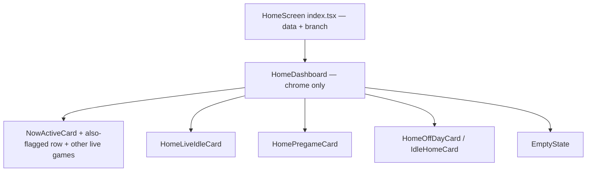
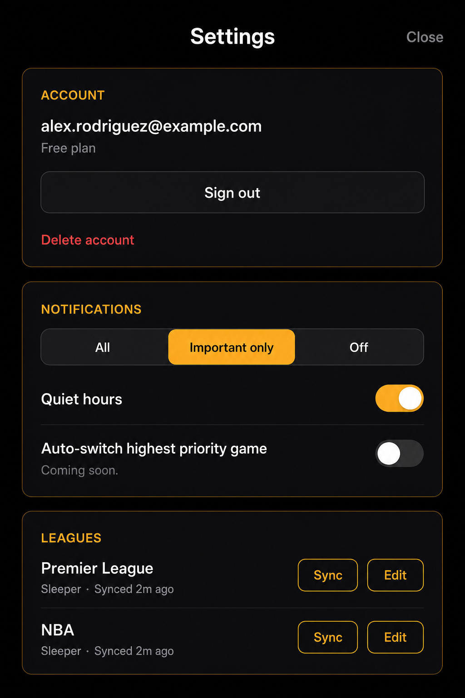

# UI Visual Spec — "Sportsbook Lounge" pass (sidecar, not source of truth)

Read-only, no-op pass: no `PLAN.md` or `app/` edits happened alongside this file. This is the incoming design brief translated into this repo's actual stack, tokens, and shipped screens, plus two rendered mockups so the look can be judged before anything is built. Treat it the same way as `[AUDIT-UI-POLISH.md](AUDIT-UI-POLISH.md)` — an inventory/intent document that a future sprint can turn into real diffs against `[app/lib/theme.ts](app/lib/theme.ts)` and the screens under `app/app/(app)/`. If a later pass implements any of this, fold the relevant parts into `PLAN.md` Section 10 and delete this file rather than letting two UX specs drift.

**Status update (Sept 18, 2026): Home State 1 shipped.** §3.1 (field gauge), §3.3 (possession glow), §6 (`HomeDashboard`), and the Home State 1 row of §7/§9 below described proposals; those are now implemented (`app/components/FieldGauge.tsx`, `NowActiveCard.tsx`, `AlsoFlaggedRow.tsx`, `HomeDashboard.tsx`) and folded into `PLAN.md` §10's State 1 description, which is the source of truth for that screen going forward — the sections below are left in place as a historical record of the proposal, marked shipped inline, rather than deleted, since they still explain *why* each choice was made. Settings (§2 switch tinting, §3.2 sync slider) and the layout/web/TV notes (§4) remain live, unshipped proposals.

**Status update (Sept 23, 2026): Home State 2 scoreboard parity shipped.** Until now, `HomeLiveIdleCard` (State 2) only inherited the field gauge stick from State 1 (per §3.1 below) — its matchup line was still plain `AWAY @ HOME` text with a small inline score. It now also renders each live row with the same `fieldAlignedMatchup` scoreboard (team-color-washed name+score chips split by a divider) as `NowActiveCard`'s hero card. Folded into `PLAN.md` §10's State 2 description, which is the source of truth for that screen going forward.

## 0. Stack correction

The source brief was written against Tailwind CSS, `backdrop-filter`, `box-shadow`, and three CSS breakpoints. This is an Expo / React Native client with dark-only design tokens in `app/lib/theme.ts`, styled via `StyleSheet.create`, no CSS engine, and (`PLAN.md` §4) **no web or TV app in v1**. Every recipe below is restated in that vocabulary. Where the brief assumes a capability this repo doesn't have (blur, motion, a settings field, live yardage data), that's called out as a gap rather than quietly implemented as if it already existed.


| Brief concept                               | This repo's equivalent                                                                                                                                                                      |
| ------------------------------------------- | ------------------------------------------------------------------------------------------------------------------------------------------------------------------------------------------- |
| Tailwind utility classes                    | `theme.colors` / `theme.spacing` / `theme.radii` / `theme.type` tokens, consumed via `StyleSheet.create` and the shared recipes in `[app/lib/controlRecipes.ts](app/lib/controlRecipes.ts)` |
| `backdrop-filter: blur(20px)` glassmorphism | Not free on RN. Deferred — see §2                                                                                                                                                           |
| `box-shadow` amber glow                     | iOS `shadow*` props / Android `elevation` on `View`, both platforms via `StyleSheet`                                                                                                        |
| Geometric sans / monospace ticker           | Shipped for real (Sept 18–19, 2026) — Plus Jakarta Sans + JetBrains Mono + Space Grotesk via `expo-font`, baked into `theme.type.*`'s `fontFamily` fields. See §2.4                         |
| React/TypeScript components                 | Same — this app already is React Native + TypeScript strict, see `[app/components/](app/components)`                                                                                        |
| `lg:` breakpoint / 3-column web             | Out of v1 per `PLAN.md` §4 ("Android, web, TV apps"). Documented as future-web notes only, §4 below                                                                                         |
| TV / AirPlay billboard mode                 | Maps to `PLAN.md` §14's unbuilt Screen Mirroring reframe, not a v1 presentation flag. See §4                                                                                                |


## 1. Palette: what already matches, what's new

The amber/dark palette in the brief is already this app's palette. `PLAN.md`'s Known Issues (the "competing accent colors" entry, resolved pre-Sprint-10) recorded `#FFB020` as the chosen accent because no NFL team owns it as a primary; that hue was later warmed to **`#F5A018`** (commit `2f78a67`), which is what `app/lib/theme.ts` pins today. This pass doesn't change that decision.

**Already in** `app/lib/theme.ts`**, unchanged:**


| Token                  | Value     |
| ---------------------- | --------- |
| `colors.accent`        | `#F5A018` |
| `colors.accentPressed` | `#D68C10` |
| `colors.onAccent`      | `#412402` |
| `colors.textPrimary`   | `#FFFFFF` |


**Proposed additions** (sketched in §5; not applied to `theme.ts` in this pass — `app/lib/theme.test.ts` pins the current hexes, so any of these would be a deliberate follow-up edit with test changes, not a silent swap):


| New token                        | Value                      | Replaces / sits alongside                                                                  |
| -------------------------------- | -------------------------- | ------------------------------------------------------------------------------------------ |
| `colors.canvas`                  | `#000000`                  | Optional harder-black screen background vs. today's `colors.background` (`#0B0B0F`)        |
| `colors.surface` (revised)       | `#121417`                  | Today `#1A1A20`                                                                            |
| `colors.surfaceRaised` (revised) | `#1A1C20`                  | Today `#22222A`                                                                            |
| `colors.textSecondary` (revised) | `#94A3B8`                  | Today `#9A9AA3` — close enough that this is a nice-to-have, not a fix                      |
| `colors.accentBorder`            | `rgba(245, 160, 24, 0.25)` | Shipped — glass-panel stroke                                                               |
| `colors.accentGlow`              | `rgba(245, 160, 24, 0.15)` | Shipped — shadow color for the "active" glow in §2.3                                       |
| `colors.dangerMuted`             | `rgba(255, 90, 90, 0.14)`  | Already hand-rolled inline at `app/app/(app)/(tabs)/settings.tsx` — this just gives it a name |


No new hue is introduced. `danger` (`#FF5A5A`) and `success` (`#3ECf8E`) are untouched.

**Color rules (PIVOT-STAKES-PLAN.md §11.1, shipped with the amber ladder in U1):**
- Amber never means warning or error. Danger stays `#FF5A5A`, and the field gauge's red zone stays red.
- Flare (`#FFC94D`) and its glow appear only when something is live. Stillness means nothing is happening.
- Team colors are the second accent. Use them only as stripes, bands or washes, never as text color on black.
- **Flare exception:** `flare` is a deliberate, scoped exception to the single-accent rule. It is the accent's highlight, used only while something is live, and never for CTAs, borders or resting states. `accent` (`#F5A018`) stays the single interactive color.

## 2. Material traits, translated

### 2.1 Borders

"Thin 1px stroke, semi-transparent amber to charcoal gradient" → RN `View` doesn't do gradient borders without an extra dependency (no `expo-linear-gradient` in this repo today). Ship the flat version first: `borderWidth: 1, borderColor: theme.colors.accentBorder` on panels that should read as "active" (e.g. the Now Active card border when a flag is live). A true gradient stroke is a `expo-linear-gradient`-add, out of scope for this pass.

### 2.2 Glass panels

"`backdrop-filter: blur(20px)`" has no zero-cost RN equivalent. Two honest options, neither applied in this pass:

- **Flat approximation (recommended default):** `surface` fill + `accentBorder` stroke + the glow in §2.3. This is what the mockups in §9 render.
- **Real blur:** `expo-blur`'s `BlurView` over a translucent scrim, only over content that's genuinely layered above something (e.g. the switching overlay's scrim in `app/contexts/SwitchingContext.tsx`, which already uses `rgba(0,0,0,0.72)`). This would be a new dependency and a real perf check on device, not a drop-in swap for the app's static cards, which don't sit above other content.

### 2.3 Amber glow

Direct RN mapping — no gap here. **Shipped:** `theme.effects.panelGlow` is real, and the live-only
`flareGlow` alongside it is specified in PIVOT-STAKES-PLAN.md §11.1. Read `app/lib/theme.ts` for the
actual values; the sketch below is kept for its rationale only.

```ts
// sketch — proposed theme.effects, see §5
panelGlow: {
  shadowColor: theme.colors.accent,
  shadowOffset: { width: 0, height: 0 },
  shadowOpacity: 0.15,
  shadowRadius: 20,
  elevation: 8, // Android fallback; RN shadow* props are iOS-only
},
```

Apply to `NowActiveCard`'s outer `View` when a flag is active, and to whichever live-game row in `HomeLiveIdleCard` matches the current possessing team.

### 2.4 Typography — real bundled fonts, not system font (updated Sept 23, 2026)

`theme.type` already has a full scale (`title`/`heading`/`body`/`bodyStrong`/`caption`/`button`/`small`/`smallStrong`/`eyebrow`/`ticker`/`score` — `app/lib/theme.ts`). The brief's "geometric sans" was first tried with `@expo-google-fonts/manrope` (Sept 13, 2026) and **reverted** — at Manrope's weight/tracking the difference from the system font (SF Pro on iOS) wasn't visible enough to justify a new dependency + native rebuild.

A second pass (Sept 18–19, 2026) tried a three-family combo instead and **kept it this time** — this superseded the Manrope revert above rather than confirming it. `theme.type.title`/`heading`/`eyebrow`/`ticker`/`score` now bake in real `fontFamily` values (`app/lib/theme.ts`), loaded via `expo-font` + `@expo-google-fonts/plus-jakarta-sans`, `@expo-google-fonts/jetbrains-mono`, and `@expo-google-fonts/space-grotesk` (registered in `app/lib/fonts.ts`'s `displayFontMap`, consumed by the root layout's `useFonts` call). This is **not** system-font-only:

- **Plus Jakarta Sans** (Bold/SemiBold) — screen titles (`theme.type.title`/`heading`), team nicknames, and score digits (`theme.type.score`, plus `NowActiveCard`/`HomeLiveIdleCard`'s local `teamName` style — both now share the same field-aligned scoreboard, §3.1/§9).
- **JetBrains Mono** (Bold/SemiBold/Medium) — eyebrows ("NOW ACTIVE", `theme.type.eyebrow`), the clock/field-position ticker (`theme.type.ticker`), and the reason chip text.
- **Space Grotesk** (Bold) — the "Watch on {service}" CTA label only (`fonts.teamNickname` in `app/lib/fonts.ts` — misleading key name, see its inline comment).
- `theme.type.score`/`ticker` both carry `fontVariant: ['tabular-nums']` regardless of family, so digits don't reflow as they change width.
- `AlsoFlaggedRow`'s "ALSO FLAGGED" label uses the `eyebrow` token directly (same family as "NOW ACTIVE"), not a separate smaller style.

## 3. Advanced visualizations: mapped to real data, or marked as gaps

### 3.1 Linear field gauge — SHIPPED

`GameSummary` (`app/lib/flagEventPayload.ts`) and `LiveGame` (`app/lib/schedule.ts`) both already carry `yards_to_endzone`, `down`, and `distance` alongside `quarter`/`time_remaining_sec`/`possession_team` — the data gap this section originally described (no yardline on any client-facing wire type) no longer exists; a later pass added the field before this visual work started. Building the real gauge was therefore a pure display change, not a Section 9 API change.

`app/components/FieldGauge.tsx` renders a numbered 100-yard stick — tick-labeled yard lines (`10 20 30 40 50 40 30 20 10`, flat fill only, no `expo-linear-gradient`), an **always-on** red-zone geography on the opponent's 20 with a "RED ZONE" caption (not gated behind a red-zone check — the geography is always there, just like a real broadcast graphic; only the ball's position changes), a gold possession marker (`fieldGaugeMarkerPercent`), and a field-position caption (`IND 32`) under the marker. The clock line (`Q2 · 7:14`, appending down/distance when present via `gameClockLine`) always renders, including when `yards_to_endzone` is null (kickoff/timeout) — in that case the stick itself is omitted but the clock stays, so `NowActiveCard` never loses the clock the way the pre-gauge version did. `HomeLiveIdleCard` (State 2) mounts the same component, so it inherited the richer stick for free — and (Sept 23, 2026) also mounts the same `fieldAlignedMatchup` scoreboard treatment described in §9 below, so State 2's live rows match State 1's hero card instead of falling back to plain `AWAY @ HOME` text.

No team logos anywhere on Home — `GameSummary`/`LiveGame` carry no logo field, and adding one is out of scope for this pass; team identity on the "Also flagged" cards is a color dot (`*_team_primary_color`) plus abbreviation instead.

### 3.2 Hardware-style sync slider

**Product gap, not just a visual one.** There is no user-facing stream-delay preference anywhere in `PLAN.md` Section 7 (data model) or Section 9 (API). `BROADCAST_LAG_SECONDS` (`PLAN.md:785`) is a fixed, server-side, per-platform constant consumed by the dispatcher (`services/dispatcher`'s `scheduleFlagEvent.ts`) — the user never sets it, and Settings has no field to bind a slider to. Skipping this widget for v1 of the spec rather than adding a `users.preferences` field here as if it already existed; that would be a `PLAN.md` §7/§9 change to propose separately, not a UI-only sketch.

If/when that preference exists, the control maps cleanly to a custom `PanResponder`- or `react-native-gesture-handler`-backed track using `theme.colors.accent` for the fill and `theme.colors.border` for the rail, with tick labels at the network presets the brief names (+15s cable, +30s YouTube TV, +45s Hulu Live) pulled from the same `BROADCAST_LAG_SECONDS` map so the UI and the dispatcher's actual timing can't drift apart.

### 3.3 Possession glow — SHIPPED

`theme.effects.panelGlow` (§2.3) is applied to:

- `NowActiveCard`'s outer card, unconditionally (it only renders for an active flag, so there's no separate possession check to gate it on)
- the specific row in `HomeLiveIdleCard` whose `possession_team` is non-null, rather than every row
- deliberately **not** applied to `AlsoFlaggedRow`'s cards — that treatment stays reserved for the card that owns the user's primary flag

Still a static glow, as originally scoped — pulsing needs an animation primitive this repo doesn't import (no Reanimated/Animated usage in `app/components/`). That remains a follow-up, not a blocker.

## 4. Layout: mobile ships, web/TV are notes

**Mobile is the only v1 layout.** `PLAN.md` §4 lists web and TV as explicitly out of scope; there's exactly one Expo Router tree (`app/app/`) and no responsive breakpoint logic anywhere in the client. This spec does not add a "bottom 40%" utility chrome layer — Home already has one header + one scrollable body, and moving primary actions to a fixed bottom band would conflict with the existing header/Settings-modal pattern rather than improve it. The one piece of the mobile brief that's already shipped: "Also flagged" as a horizontal scroll row of smaller cards is literally what `PLAN.md` Section 10 State 1 specifies, and is now built as situation cards (§3.1/§9) — swipeable chips for the bench/other-games list ("Other live games" / "Today's other games," still unbuilt) is a density option for that row, not a new concept.

**Laptop/web 3-column command center — out of v1.** Recorded here only so a future web client (if one is ever built) inherits the same token names instead of a fresh palette:

- Left: league sync state + starred players (`Settings` → Leagues / Star players sections today)
- Center: live multi-game board (`Home` States 1-4 today)
- Right: sync/notification settings (`Settings` → Notifications section today)

No `lg:` breakpoint, no CSS grid — this is a paragraph, not a component.

**TV / AirPlay billboard mode — not a v1 presentation flag.** `PLAN.md` §14 already scoped this territory as the "Screen Mirroring reframe": unbuilt, needs its own UX design, and premised on the *user* enabling Screen Mirroring from Control Center — an app cannot trigger a presentation mode on its own, and §14 is explicit that deep-linking into a streaming app ends any mirrored session, so "big-screen mode" and the shipping deep-link flow may be mutually exclusive rather than layered. This spec doesn't add a `isPresenting` flag or a scaled-up card variant; it points at §14 as the place that idea already lives.

## 5. Sketch: `theme.ts` additions (documentation only — not applied)

**Superseded by PIVOT-STAKES-PLAN.md §11.** Every key below except `canvas` has shipped, and the
amber ladder (`ember`, `emberSolid`, `brass`, `flare`, `well`, `wellBorder`, `rowDivider`,
`flareGlow`) was added in U1. The literal values in this sketch are stale — `accentBorder` and
`accentGlow` shipped as `rgba(245, 160, 24, …)`, derived from the real accent `#F5A018`, not from
the canvas hex this sketch was drawn against. `app/lib/theme.ts` and its pinning test are the
source of truth; this block is kept for its rationale only.

Additive only. Nothing here changes an existing hex that `app/lib/theme.test.ts` currently pins (`background`, `surface`, `accent`, etc.) — a real visual pass would update both the token file and its test in the same diff, not sneak a palette shift in under this spec.

```ts
// app/lib/theme.ts — proposed additive keys, not applied in this pass
colors: {
  // ...existing keys unchanged...
  canvas: '#000000',
  accentBorder: 'rgba(255, 176, 32, 0.25)',
  accentGlow: 'rgba(255, 176, 32, 0.15)',
  dangerMuted: 'rgba(255, 90, 90, 0.14)',
},
type: {
  // ...existing keys unchanged...
  score: { size: 22, weight: '700', lineHeight: 28 },
  ticker: { size: 13, weight: '500', letterSpacing: 0 },
},
effects: {
  panelBorderWidth: 1,
  panelGlow: {
    shadowColor: theme.colors.accent,
    shadowOffset: { width: 0, height: 0 },
    shadowOpacity: 0.15,
    shadowRadius: 20,
    elevation: 8,
  },
},
```

## 6. `HomeDashboard` wrapper — SHIPPED

`app/components/HomeDashboard.tsx` pulls layout chrome out of `HomeScreen` (`app/app/(app)/(tabs)/index.tsx`) without touching data fetching, WebSocket wiring, or the branch logic in `resolveHomeBranch`. `HomeScreen` keeps `load`/`renderBody`/`useHomeRealtime`; the wrapper only owns the screen background, header row, scroll container, and pull-to-refresh (`refreshing`/`onRefresh` props — one addition beyond the original sketch, needed because Home's cold-start fetch has to be user-retriggerable). The header row's "Settings" link uses `TextButton`'s muted tone rather than the default accent tone, so it doesn't compete with the CTA below it for attention.

State 1 still composes the existing cards inside it — the wrapper does not become a multi-column command center on phone:




## 7. Zone-by-zone mapping


| Zone                                                            | Today                                                                                                                                                                 | Spec treatment                                                                                                                                                                             |
| --------------------------------------------------------------- | --------------------------------------------------------------------------------------------------------------------------------------------------------------------- | ------------------------------------------------------------------------------------------------------------------------------------------------------------------------------------------ |
| Onboarding streaming (`app/app/(app)/onboarding-streaming.tsx`) | Pill chips, `radii.pill`, accent fill when selected (`:104-116`)                                                                                                      | Larger block variant: unselected = `surface` fill + muted icon; selected = 2px `accentBorder` wrap + `textPrimary` icon. Same data (`STREAMING_SERVICES`), no new fields — still unshipped |
| Home (`app/app/(app)/(tabs)/index.tsx`)                          | **Shipped** — `HomeDashboard` wrapper (§6), State 1's numbered field gauge (§3.1) and possession glow (§3.3), outlined reason chip, situation-card "Also flagged" row | See `PLAN.md` §10 for the current State 1 description — this row is historical                                                                                                             |
| Settings (`app/app/(app)/(tabs)/settings.tsx`)                   | Grouped `SectionCard`s: Account, Notifications, Streaming, Leagues, Star players, About                                                                               | Groupings unchanged. Switches get `SWITCH_THUMB`/`SWITCH_TRACK` amber tinting (already partially wired per `settings.tsx`); no sync slider added — §3.2 explains why                       |


## 8. Explicitly not in this pass

- No edits to `app/lib/theme.ts`, `theme.test.ts`, or any component.
- No `PLAN.md` Section 7/9/10 edits — the data-model and product gaps in §3 would need their own proposal there first.
- No Tailwind, no web layout, no TV presentation flag.
- No new dependencies (`expo-blur`, `expo-linear-gradient`, Reanimated) added — each is called out above as a future option, not installed here.
- No user-facing stream-delay preference invented.

## 9. Mockups: current vs. proposed

AI-generated preview renders, not app assets — this app has no `app/assets/` directory (see `AUDIT-UI-POLISH.md` §4.3), and these live in `docs/ui-spec/` specifically so they aren't mistaken for one. They're illustrative only: exact spacing/type came from `theme.ts` and the components cited below, but the renders themselves aren't pixel-accurate simulator output, and the Settings render's placeholder league names ("Premier League", "NBA") are render noise — this app only has Sleeper NFL leagues.

### Home, State 1 — SHIPPED, matches the proposed mockup

`docs/ui-spec/home-proposed.png` is no longer aspirational — it's what `NowActiveCard` + `FieldGauge` + `AlsoFlaggedRow` render today. `docs/ui-spec/home-current.png` is kept only as the historical "before" reference (flat `surface` fill, no border/glow, plain clock strip, no also-flagged row below the hero).

Shipped, matching the mockup: 1px `accentBorder` stroke + `panelGlow` on the hero card; accent-colored "NOW ACTIVE" eyebrow; uppercase team nicknames (`COLTS @ TITANS`); the numbered field gauge from §3.1 (real yardline data, always-on red-zone geography, no illustrative placeholder); an outlined (not filled) reason chip; and the "Also flagged" row as situation cards (color-dot team rows + clock/position/down-distance, accent-outlined Switch) rather than the bare matchup+score+Switch cards it originally shipped with. No team logos on either card — a deliberate non-goal, not a gap; team identity is the color dot + abbreviation. See `PLAN.md` §10 for the maintained State 1 description going forward.

### Home, State 2 — SHIPPED (Sept 23, 2026), scoreboard parity with State 1

No separate mockup was rendered for this state — the only visual delta from State 1's hero card is the missing reason chip/CTA (State 2 has no active flag to react to). `HomeLiveIdleCard` renders each live stake-game row with the identical `fieldAlignedMatchup` scoreboard from State 1 above (team-color-washed name+score chips split by a divider) plus the numbered field gauge, replacing the plain `AWAY @ HOME` text + small inline score it shipped with originally. See `PLAN.md` §10 for the maintained State 2 description going forward.

### Settings — proposed only

No "current" render for Settings: the existing screen (`app/app/(app)/(tabs)/settings.tsx`) already matches this structurally (grouped `SectionCard`s for Account / Notifications / Leagues, etc.), so the delta is the border/glow treatment from §2 and amber-tinted switch tracks, not a layout change worth a side-by-side.



No sync slider rendered, matching §3.2 — that control has no backing preference yet.